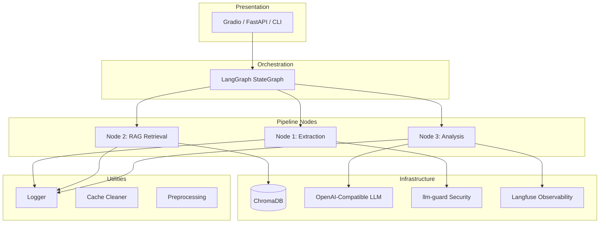
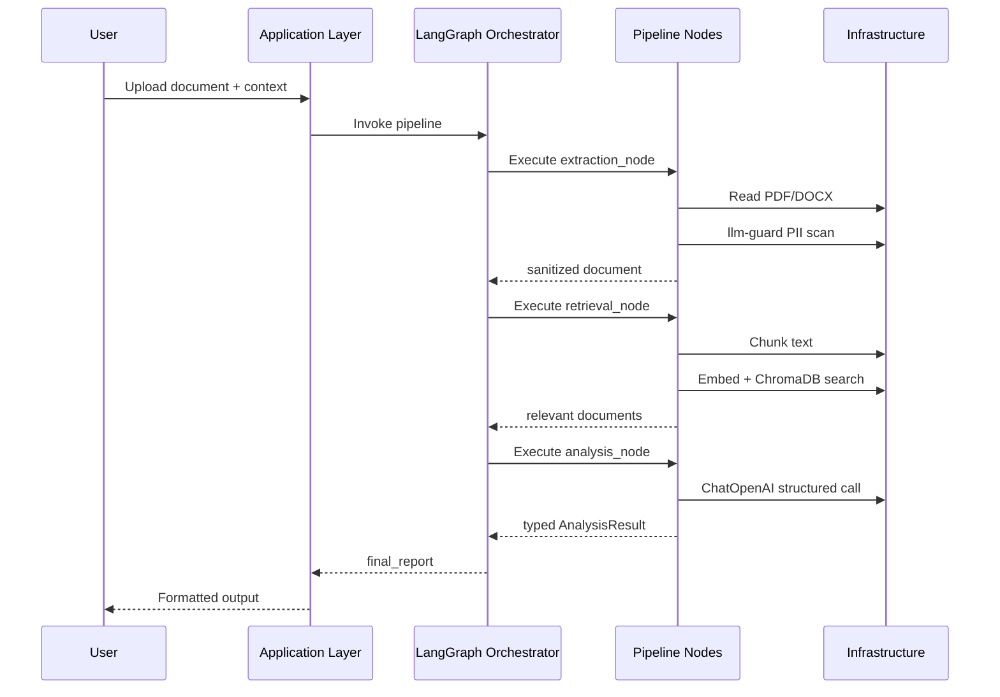

# 🧩 Production-Ready Document Analysis Pipeline Template

> A modular, secure, and extensible boilerplate for building LLM-powered document processing applications with RAG, structured output, and full observability.

---

## 📌 Description

This boilerplate provides a **production-ready architectural template** for building document analysis applications powered by Large Language Models. It demonstrates a **modular pipeline architecture** using **LangGraph** for orchestration, **RAG (Retrieval-Augmented Generation)** for semantic search, and **structured LLM output** for consistent results.

The template is designed to be **technology-agnostic** — all business logic has been abstracted away, leaving behind a clean, reusable foundation that showcases modern Python backend patterns:

- **Clean Architecture** — separation of concerns across nodes, models, and utilities
- **Stateful Workflow Orchestration** — LangGraph StateGraph for deterministic pipelines
- **RAG Pattern** — chunking, embedding, and vector retrieval with ChromaDB
- **Structured Output** — Pydantic models for typed LLM responses
- **Security-First** — PII anonymization and prompt injection detection via `llm-guard`
- **Observability** — Langfuse integration for LLM tracing and monitoring
- **Production Logging** — `structlog` with third-party logger silencing

---

## 🧰 Key Features

### Architecture & Design
- **Modular Node-Based Pipeline** — each processing stage is an independent, testable node
- **LangGraph StateGraph Orchestration** — deterministic, composable workflow
- **Pydantic Structured Output** — type-safe LLM response schemas
- **RAG with ChromaDB** — semantic document retrieval using HuggingFace embeddings

### Security & Privacy
- **PII Anonymization** — automatic detection and redaction of personal data (names, emails, phones, URLs)
- **Prompt Injection Protection** — input sanitization before LLM processing
- **Local-First LLM** — runs via llama.cpp or any OpenAI-compatible API — no data leaves your infrastructure
- **Session Isolation** — temporary files cleaned after each processing cycle

### Developer Experience
- **`uv` Package Management** — fast, dependency-resolved Python environments
- **Pytest Configuration** — built-in test runner with pytest
- **Structured Logging** — `structlog` with configurable log levels and file/console handlers
- **Environment Configuration** — `.env`-based config with `.env.example` template

### Observability
- **Langfuse Integration** — LLM call tracing, token usage, and latency monitoring
- **Centralized Logger** — consistent log format across console and file outputs
- **Error Handling** — graceful degradation with typed error passthrough

---

## 🏗️ Architecture & Design Patterns

### High-Level Pipeline Flow

```mermaid
flowchart LR
    A[Document Input\n(PDF / DOCX)] --> D[Extraction Node]
    B[Context Input\n(Text)] --> D
    D --> E[Sanitization\n(PII + Injection)]
    E --> F[RAG Retrieval\n(Chunk + Embed + Search)]
    F --> G[Analysis Node\n(Structured LLM)]
    G --> H[Final Output\n(JSON / Report)]
```

### Technical Layering



### Project Structure

```
project-template/
├── config/
│   ├── prompts/
│   │   └── instructions.txt   # LLM prompt template (customizable)
│   └── assets/                # Static assets (logos, banners)
├── models/
│   └── schemas.py             # Pydantic + TypedDict data schemas
├── nodes/
│   ├── extraction.py          # Node 1: Document text extraction
│   ├── retrieval.py           # Node 2: RAG vector retrieval
│   └── analysis.py            # Node 3: Structured LLM analysis
├── tests/
│   └── test_nodes.py          # Unit tests (pytest)
├── utils/
│   ├── __init__.py
│   ├── logger.py              # Centralized structured logging
│   ├── cache_cleaner.py       # Temporary file management
│   └── preprocessing.py       # Text transformation utilities
├── graph.py                   # LangGraph workflow definition
├── app.py                     # Entry point (UI / API server)
├── pyproject.toml             # Dependencies + tool config
├── .env.example               # Environment configuration template
├── .gitignore
├── logs/                      # Application logs (runtime)
└── README.md
```

### Data Flow



---

## 🚀 Getting Started

### Prerequisites

- **Python 3.10–3.13**
- [uv](https://docs.astral.sh/uv/) package manager
- A running **llama.cpp server** (or any OpenAI-compatible API endpoint)
- **NVIDIA GPU** recommended (CUDA 12.8+) for local model inference

### Installation

```bash
# Clone the repository
git clone https://github.com/<your-username>/<your-repo>.git
cd <your-repo>

# Install dependencies
uv sync
```

### Configuration

Copy `.env.example` to `.env` and fill in your values:

```dotenv
# LLM
OPENAI_BASE_URL="http://localhost:8000"
OPENAI_API_KEY="sk-no-key-required"
OPENAI_DEFAULT_MODEL="your-model-name"
GEN_TEMPERATURE="0.0"
GEN_MAX_TOKENS="2048"

# Observability
LANGFUSE_PUBLIC_KEY="your_public_key"
LANGFUSE_SECRET_KEY="your_secret_key"
LANGFUSE_HOST="https://cloud.langfuse.com"

# Application
GRADIO_TEMP_DIR="./temp_data"
LOG_LEVEL="INFO"
```

### Run

```bash
# Start the application
uv run app.py

# Run tests
uv run pytest tests/ -v

# Run with verbose logging
LOG_LEVEL=DEBUG uv run app.py
```

---

## 🧪 Testing

```bash
uv run pytest tests/ -v
```

Tests cover:
- **extraction_node**: text extraction, PII blocking, unsupported formats
- **retrieval_node**: empty inputs, valid retrieval, exception handling
- **analysis_node**: error passthrough, LLM failure, structured output

---

## 🔒 Privacy & Security

| Feature | Description |
|---------|-------------|
| **PII Anonymization** | Names, emails, phone numbers, and URLs are detected and redacted by `llm-guard` before any LLM call |
| **Prompt Injection Detection** | All inputs are scanned for malicious prompt injection patterns |
| **Local-First Processing** | The LLM runs locally via llama.cpp — no external API calls |
| **Session Cleanup** | Temporary uploads are automatically cleaned after each processing cycle |

---

## 📦 Customization Guide

This boilerplate is designed to be adapted for various use cases:

| Current | Customization |
|---------|--------------|
| Document Input | Replace with API payloads, database records, or stream sources |
| Context Input | Replace with user queries, metadata, or external data |
| RAG Retrieval | Swap ChromaDB for Pinecone, Weaviate, or Qdrant |
| LLM Analysis | Replace with any OpenAI-compatible model or custom endpoint |
| Output Format | Modify Pydantic schema to match your domain model |

---

## 📄 License

This project is licensed under the MIT License — see [LICENSE.md](../LICENSE.md) for details.

---

## 🙏 Acknowledgments

- **LangGraph** — Workflow orchestration for stateful agents
- **llm-guard** — Security scanning for LLM inputs
- **Langfuse** — LLMOps observability platform
- **ChromaDB** — Embedded vector database
- **uv** — Lightning-fast Python package manager